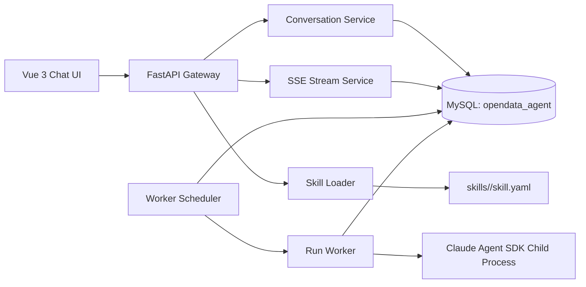

# 基于 Skill 管理的通用 Agent 平台设计

- 日期：2026-03-13
- 状态：v1 设计稿
- 适用范围：单组织内部平台，MySQL-only，自托管部署

## 1. 概述

本文档定义一个以 `Claude Agent SDK` 为主执行路径的通用 Agent 平台。平台面向内部业务团队，支持：

- 基于 `Skill` 的智能体切换与运行控制
- 多轮对话、会话历史、会话持久化
- `thinking/reasoning` 折叠展示与时间线回放
- `tool call` 输入、执行、输出的可视化 block
- `chart/table/json/text` 等结构化结果渲染
- 基于 MySQL 的消息存储、运行队列、事件流和断线恢复

平台的目标是用统一的前端交互模型和统一的事件协议，承接不同 Agent 执行引擎。`Claude Agent SDK` 是 v1 主引擎，但系统保留 `EngineAdapter` 抽象，后续可接入 Claude Messages API 或其它执行路径。

## 2. 设计目标与非目标

### 2.1 目标

- 提供稳定的多轮对话体验，历史可回放且可继续上下文
- 用 `UIMessage.parts` 作为前端唯一渲染事实源
- 用 MySQL 单库承载业务数据、运行队列和事件流，降低基础设施复杂度
- 通过 `Skill` 文件包管理 system prompt、工具权限、MCP 绑定、渲染策略和会话策略
- 对 `thinking`、`tool call`、`artifact` 建立统一的可观察模型
- 通过子进程隔离降低 Agent SDK 会话串扰风险

### 2.2 非目标

- v1 不实现完整 SaaS 多租户后台
- v1 不实现在线 Skill 可视化编辑器
- v1 不引入 Redis、Celery、对象存储
- v1 不承诺跨服务崩溃的无感续跑，只保证事件可回放、运行可重试

## 3. 技术基线

### 3.1 前端

- `Vue 3`
- `Vite`
- `Element Plus`
- `TailwindCSS`
- `@ai-sdk/vue`
- `Apache ECharts`

### 3.2 后端

- `Python 3.11+`
- `FastAPI`
- `SQLAlchemy 2.x` 或 `sqlmodel`
- `Pydantic v2`
- `Claude Agent SDK Python`
- `SSE` 输出

### 3.3 存储

- 本地 Docker 已启动的 `MySQL 8.0+`
- 独立 schema：`opendata_agent`

MySQL 需要支持：

- `JSON`
- `SELECT ... FOR UPDATE SKIP LOCKED`
- 合理的索引和分页能力

## 4. 总体架构



系统按四层实现：

1. 前端交互层：负责聊天台、parts 渲染、SSE 订阅、历史回放。
2. API 网关层：负责对话 API、运行入口、消息聚合、技能装载和协议转换。
3. 执行层：负责 run 领取、Agent SDK 子进程生命周期、工具事件标准化。
4. 存储层：负责会话、消息、运行、事件、工具调用、artifact 和 skill 快照存储。

## 5. 端到端核心流程

### 5.1 发送消息

1. 前端调用 `POST /api/conversations/{id}/messages`
2. 网关在事务内写入：
   - 一条 `messages(role=user)`
   - 一条 `runs(status=queued)`
3. 前端拿到 `runId` 后连接 `GET /api/runs/{runId}/stream?after_seq=0`
4. Worker 轮询 `runs` 表，使用 `FOR UPDATE SKIP LOCKED` 领取任务
5. Worker 启动独立 Agent SDK 子进程，并持续把事件写入 `run_events`
6. SSE 服务轮询 `run_events` 并持续输出 JSON 事件
7. run 完成后，Worker 回写 `messages(role=assistant)` 的 `raw_blocks` 和 `ui_parts`

### 5.2 页面刷新恢复

1. 前端保存当前 `runId` 和已消费的 `seq`
2. 刷新后重新连接 `GET /api/runs/{runId}/stream?after_seq=<lastSeq>`
3. SSE 服务先回放 `run_events.seq > lastSeq` 的历史
4. 若 run 未结束，则继续 tail 新事件
5. 历史消息页直接查询 `messages.ui_parts`

### 5.3 取消运行

1. 前端调用 `POST /api/runs/{runId}/cancel`
2. 网关更新 `runs.cancel_requested=1`
3. Worker 检测到取消标记后终止子进程
4. Worker 追加 `finish` 事件并把 run 状态设为 `cancelled`

## 6. Skill 设计

### 6.1 Skill 文件结构

```text
skills/
  analyst/
    skill.yaml
    prompt.md
    assets/
  sql-investigator/
    skill.yaml
    prompt.md
    assets/
```

### 6.2 SkillManifest

`skill.yaml` 是事实来源，最小字段如下：

```yaml
id: analyst
name: Data Analyst
version: 1.0.0
engine: claude-agent-sdk
entry_prompt: ./prompt.md
allowed_tools:
  - Read
  - Bash
  - WebSearch
disallowed_tools:
  - Write
  - Edit
mcp_servers:
  - mysql-local
renderers:
  preferred_chart: echarts
  show_reasoning_timeline: true
risk_policy:
  approval_mode: on_dangerous_tools
  mask_thinking_by_default: true
session_policy:
  max_turns_before_summary: 30
  artifact_inline_threshold_kb: 256
  continue_on_interrupted_run: true
```

### 6.3 Skill Loader 职责

- 扫描 `skills/*/skill.yaml`
- 解析并校验 manifest
- 读取 `prompt.md`
- 计算 `content_hash`
- 将当前加载版本写入 `skill_snapshots`
- 提供内存缓存和主动 reload 能力

### 6.4 Skill 版本策略

- 会话创建时记录 `skill_id + skill_version + skill_hash`
- 运行时使用快照，不直接依赖磁盘最新内容
- reload 后仅影响新会话或显式切换后的新 run

## 7. 前端设计

## 7.1 页面结构

聊天台由六个区域组成：

- 左侧：会话列表
- 顶部：Skill 切换器、当前模型/状态标记
- 中部：主消息流
- 底部：输入区
- 顶部或底部：运行状态条
- 右侧抽屉或下方面板：tool/artifact 详情

## 7.2 前端状态模型

前端状态最小集合：

- `activeConversation`
- `conversationList`
- `messageList`
- `activeRun`
- `streamCursor`
- `selectedSkill`
- `artifactPreview`

消息渲染只依赖 `message.parts`，不直接拼接原始文本。

## 7.3 UIMessage.parts 映射

| part 类型 | 作用 | 默认 UI |
| --- | --- | --- |
| `text-*` | 普通文本流 | Markdown 文本气泡 |
| `reasoning-*` | thinking 摘要或 reasoning 流 | 默认折叠的推理卡片 |
| `tool-*` | 工具输入/输出生命周期 | Tool Call Block |
| `data-chart` | 图表数据 | ECharts 容器 |
| `data-table` | 表格数据 | Element Plus Table |
| `data-artifact` | 大型结果引用 | 可打开详情抽屉的 artifact 卡片 |
| `start-step/finish-step` | 多步过程边界 | Timeline step 节点 |
| `finish` | 消息结束 | 状态收尾和交互解锁 |

## 7.4 Thinking / Reasoning 展示

规则固定如下：

- 默认显示摘要标题、耗时、step 关联
- 默认折叠，不展示原始完整 thinking 文本
- 原始 thinking 仅在管理员模式或调试模式下可见
- Timeline 以 `step` 为主轴，将 reasoning、tool、artifact 串联起来

## 7.5 Tool Call Block

工具卡片至少支持五态：

- `input-streaming`
- `input-ready`
- `running`
- `output-ready`
- `failed`

卡片信息包括：

- `tool_name`
- `tool_call_id`
- 输入参数摘要
- 开始/结束时间
- 执行耗时
- 输出摘要或 artifact 引用

## 7.6 Chart / Table / JSON 渲染

- 图表优先使用 `ECharts`
- 表格使用 `Element Plus Table`
- SQL、大 JSON、长日志使用折叠代码块
- 超大结果以 artifact 形式打开，不直接内联到消息区域

## 8. 后端服务设计

## 8.1 模块划分

- `api.routes.skills`：skill 查询、reload
- `api.routes.conversations`：会话 CRUD、消息查询、消息发送
- `api.routes.runs`：stream、cancel
- `services.skill_loader`：manifest 解析、缓存、快照
- `services.conversation_service`：会话和消息事务
- `services.run_service`：run 创建、状态流转、重试
- `services.stream_service`：SSE 回放与 tail
- `engines.base`：`EngineAdapter`
- `engines.claude_agent_sdk`：Agent SDK 适配器

## 8.2 EngineAdapter

执行引擎接口统一如下：

```python
class EngineAdapter(Protocol):
    def start_run(self, run_id: str) -> None: ...
    def cancel_run(self, run_id: str) -> None: ...
    def build_session_context(self, conversation_id: str) -> dict: ...
    def map_event(self, raw_event: dict) -> list[dict]: ...
```

v1 只实现 `ClaudeAgentSdkAdapter`，但所有上层调用只依赖 `EngineAdapter`。

## 8.3 会话与消息接口

### `POST /api/conversations`

请求：

```json
{
  "title": "新建分析会话",
  "skillId": "analyst"
}
```

响应：

```json
{
  "id": "conv_123",
  "title": "新建分析会话",
  "skillId": "analyst",
  "status": "idle"
}
```

### `POST /api/conversations/{id}/messages`

请求：

```json
{
  "content": "分析最近一周的订单波动",
  "attachments": []
}
```

响应：

```json
{
  "conversationId": "conv_123",
  "userMessageId": "msg_u_001",
  "runId": "run_001",
  "status": "queued"
}
```

### `GET /api/runs/{runId}/stream?after_seq=0`

- `Content-Type: text/event-stream`
- 每条事件的 `data:` 为 JSON
- 结束时输出 `[DONE]`

事件示例：

```text
data: {"seq":1,"type":"start-step","stepId":"step_1","runId":"run_001"}

data: {"seq":2,"type":"reasoning-delta","id":"rs_1","delta":"正在判断需要查询哪些数据"}

data: {"seq":3,"type":"tool-input-available","toolCallId":"tool_1","toolName":"mysql_query","input":{"sql":"select ..."}}

data: {"seq":4,"type":"tool-output-available","toolCallId":"tool_1","outputRef":"art_001"}

data: {"seq":5,"type":"data-chart","id":"chart_1","chartType":"line","spec":{...}}

data: {"seq":6,"type":"finish","messageId":"msg_a_001","runId":"run_001"}

data: [DONE]
```

## 9. Claude Agent SDK 运行时设计

## 9.1 进程模型

- `scheduler` 进程：持续领取 `queued` 状态 run
- `worker` 进程：处理一个或多个 run，但每个 run 必须拉起独立子进程
- `child process`：实际运行 Claude Agent SDK

隔离规则：

- 不复用跨会话 SDK client
- 子进程退出即清空该 run 的执行上下文
- 父 worker 只通过标准输出/标准错误读取事件

## 9.2 子进程生命周期

1. 读取 `run`、`conversation`、`skill_snapshot`
2. 拼装 prompt、工具权限、MCP 配置
3. 启动 Agent SDK
4. 持续接收原始事件
5. 转换为标准化 `run_events`
6. 结束时回写 `assistant message` 和 `run` 最终状态

## 9.3 取消与中断

- `cancel_requested=1` 时优先向子进程发送终止信号
- 若子进程无响应，升级为强制 kill
- 非主动取消的进程异常退出统一标记为 `interrupted`

## 10. 事件协议设计

## 10.1 run_events 存储原则

- append-only，不做原地更新
- `seq` 在单个 `run_id` 下严格递增
- 每条事件有 `visible_in_history`
- 原始事件与标准化事件分离存储

## 10.2 事件类型

标准事件集：

- `start-step`
- `finish-step`
- `text-start`
- `text-delta`
- `text-end`
- `reasoning-start`
- `reasoning-delta`
- `reasoning-end`
- `tool-input-start`
- `tool-input-delta`
- `tool-input-available`
- `tool-output-available`
- `tool-failed`
- `data-chart`
- `data-table`
- `data-artifact`
- `finish`
- `abort`

## 10.3 历史快照策略

- 运行中依赖 `run_events`
- 运行结束后，聚合器将可见事件压缩为 `messages.ui_parts`
- `messages.raw_blocks` 保存模型原始块
- `messages.ui_parts` 用于历史消息页快速加载

## 11. MySQL Schema 设计

## 11.1 schema 初始化

```sql
CREATE SCHEMA IF NOT EXISTS opendata_agent
  DEFAULT CHARACTER SET utf8mb4
  DEFAULT COLLATE utf8mb4_0900_ai_ci;
```

## 11.2 核心表

### conversations

```sql
CREATE TABLE opendata_agent.conversations (
  id            VARCHAR(36) PRIMARY KEY,
  workspace_id  VARCHAR(36) NULL,
  title         VARCHAR(255) NOT NULL,
  skill_id      VARCHAR(128) NOT NULL,
  skill_version VARCHAR(32) NOT NULL,
  status        VARCHAR(32) NOT NULL DEFAULT 'idle',
  active_run_id VARCHAR(36) NULL,
  summary       TEXT NULL,
  last_message_at DATETIME(3) NULL,
  created_at    DATETIME(3) NOT NULL,
  updated_at    DATETIME(3) NOT NULL,
  KEY idx_conv_last_message_at (last_message_at DESC),
  KEY idx_conv_skill (skill_id, skill_version)
);
```

### messages

```sql
CREATE TABLE opendata_agent.messages (
  id              VARCHAR(36) PRIMARY KEY,
  conversation_id VARCHAR(36) NOT NULL,
  run_id          VARCHAR(36) NULL,
  role            VARCHAR(16) NOT NULL,
  raw_blocks      JSON NULL,
  ui_parts        JSON NOT NULL,
  usage_json      JSON NULL,
  status          VARCHAR(32) NOT NULL,
  created_at      DATETIME(3) NOT NULL,
  updated_at      DATETIME(3) NOT NULL,
  KEY idx_msg_conv_created (conversation_id, created_at),
  KEY idx_msg_run (run_id)
);
```

`raw_blocks` 规则：

- 保存原始模型块
- thinking/signature 原样存储
- 禁止 markdown 重写、trim、二次格式化

### runs

```sql
CREATE TABLE opendata_agent.runs (
  id                VARCHAR(36) PRIMARY KEY,
  conversation_id   VARCHAR(36) NOT NULL,
  skill_snapshot_id VARCHAR(36) NOT NULL,
  engine            VARCHAR(64) NOT NULL,
  status            VARCHAR(32) NOT NULL,
  cancel_requested  TINYINT(1) NOT NULL DEFAULT 0,
  attempt_no        INT NOT NULL DEFAULT 1,
  stop_reason       VARCHAR(64) NULL,
  error_code        VARCHAR(64) NULL,
  error_message     TEXT NULL,
  started_at        DATETIME(3) NULL,
  ended_at          DATETIME(3) NULL,
  created_at        DATETIME(3) NOT NULL,
  updated_at        DATETIME(3) NOT NULL,
  KEY idx_run_queue (status, created_at),
  KEY idx_run_conv (conversation_id, created_at)
);
```

### run_events

```sql
CREATE TABLE opendata_agent.run_events (
  id                 BIGINT PRIMARY KEY AUTO_INCREMENT,
  run_id             VARCHAR(36) NOT NULL,
  seq                BIGINT NOT NULL,
  event_type         VARCHAR(64) NOT NULL,
  payload_json       JSON NOT NULL,
  raw_payload_json   JSON NULL,
  visible_in_history TINYINT(1) NOT NULL DEFAULT 1,
  created_at         DATETIME(3) NOT NULL,
  UNIQUE KEY uk_run_seq (run_id, seq),
  KEY idx_run_event_tail (run_id, seq),
  KEY idx_run_event_history (run_id, visible_in_history, seq)
);
```

### tool_calls

```sql
CREATE TABLE opendata_agent.tool_calls (
  id              VARCHAR(36) PRIMARY KEY,
  run_id          VARCHAR(36) NOT NULL,
  message_id      VARCHAR(36) NULL,
  tool_call_id    VARCHAR(128) NOT NULL,
  tool_name       VARCHAR(128) NOT NULL,
  input_json      JSON NULL,
  output_summary  JSON NULL,
  artifact_id     VARCHAR(36) NULL,
  status          VARCHAR(32) NOT NULL,
  latency_ms      INT NULL,
  error_message   TEXT NULL,
  started_at      DATETIME(3) NULL,
  ended_at        DATETIME(3) NULL,
  created_at      DATETIME(3) NOT NULL,
  KEY idx_tool_run (run_id, created_at),
  UNIQUE KEY uk_tool_call (run_id, tool_call_id)
);
```

### artifacts

```sql
CREATE TABLE opendata_agent.artifacts (
  id               VARCHAR(36) PRIMARY KEY,
  run_id           VARCHAR(36) NOT NULL,
  conversation_id  VARCHAR(36) NOT NULL,
  artifact_type    VARCHAR(32) NOT NULL,
  mime_type        VARCHAR(128) NOT NULL,
  size_bytes       BIGINT NOT NULL,
  content_json     JSON NULL,
  content_text     LONGTEXT NULL,
  metadata_json    JSON NULL,
  created_at       DATETIME(3) NOT NULL,
  KEY idx_artifact_run (run_id, created_at),
  KEY idx_artifact_conv (conversation_id, created_at)
);
```

### skill_snapshots

```sql
CREATE TABLE opendata_agent.skill_snapshots (
  id             VARCHAR(36) PRIMARY KEY,
  skill_id       VARCHAR(128) NOT NULL,
  skill_version  VARCHAR(32) NOT NULL,
  content_hash   VARCHAR(128) NOT NULL,
  manifest_json  JSON NOT NULL,
  prompt_text    LONGTEXT NOT NULL,
  created_at     DATETIME(3) NOT NULL,
  KEY idx_skill_lookup (skill_id, skill_version, created_at)
);
```

## 11.3 Artifact 阈值策略

- 小于 `256KB` 的 chart/table/json 直接放在 `run_events.payload_json`
- 大于 `256KB` 的内容写入 `artifacts`
- 事件中仅保留 `artifact_id`、摘要和元数据

## 12. 会话连续性与上下文管理

## 12.1 历史读取

- 历史页读取 `messages.ui_parts`
- 继续对话时读取最近 N 轮 `messages.raw_blocks`
- `session_policy.max_turns_before_summary` 超限时触发摘要压缩

## 12.2 Thinking 处理

- 原始 thinking 只写入 `raw_blocks`
- UI 展示使用脱敏摘要或 reasoning 片段
- 对需要原样回传的引擎场景，必须从 `raw_blocks` 读取，不从 UI 快照反推

## 12.3 中断恢复

- run `interrupted` 后允许 `retry` 或 `continue`
- `retry`：从最后一条用户消息重新创建 run
- `continue`：由引擎适配器按 skill/session_policy 决定是否可继续

## 13. 安全与可观测性

## 13.1 安全边界

- 平台只按 skill 暴露允许的工具集合
- 高风险工具默认需要人工确认
- thinking 默认折叠且不开放给普通用户
- MCP 配置由后端注入，不允许前端直接提交任意 server 参数

## 13.2 审计字段

以下字段必须可检索：

- `conversation_id`
- `run_id`
- `tool_call_id`
- `skill_id`
- `status`
- `stop_reason`
- `latency_ms`
- `error_code`

## 13.3 监控指标

- 会话创建成功率
- run 排队时长
- run 总耗时
- SSE 平均延迟
- tool call 成功率
- artifact 落盘大小
- run_events 表增长速率

## 14. 部署建议

- 前端、API、Worker 分为三个容器
- MySQL 使用独立持久卷
- Skill 目录挂载为只读卷
- API 与 Worker 共用同一个 schema
- 日志统一输出到 stdout/stderr，后续可接入集中式日志系统

## 15. 风险与缓解

### 15.1 MySQL 轮询压力

风险：`run_events` 轮询 tail 会增加数据库读压。

缓解：

- 单 run 按 `run_id, seq` 走覆盖索引
- SSE 轮询间隔控制在 `200ms~500ms`
- 消息结束后立即断开 tail
- 定期归档旧 `run_events`

### 15.2 Agent SDK 会话串扰

风险：复用 SDK client 可能造成跨会话上下文泄漏。

缓解：

- 强制一 run 一子进程
- 不使用长生命周期共享 client
- 通过集成测试验证并发会话隔离

### 15.3 单库膨胀

风险：事件流、artifact 和历史消息都落到单库后，增长会较快。

缓解：

- 控制 inline 阈值
- 为历史事件做冷热分层或归档
- 后续预留对象存储/消息队列替换位

## 16. v1 验收标准

- 支持创建会话、切换 skill、发送多轮消息
- 支持刷新后从 `after_seq` 恢复流式输出
- 支持 thinking 默认折叠与 timeline 展示
- 支持 tool call 五态 block
- 支持 chart/table/artifact 渲染
- 支持 skill reload 和非法 skill 校验失败
- 支持并发会话隔离和取消运行
- MySQL-only 架构下具备最小可运维性
